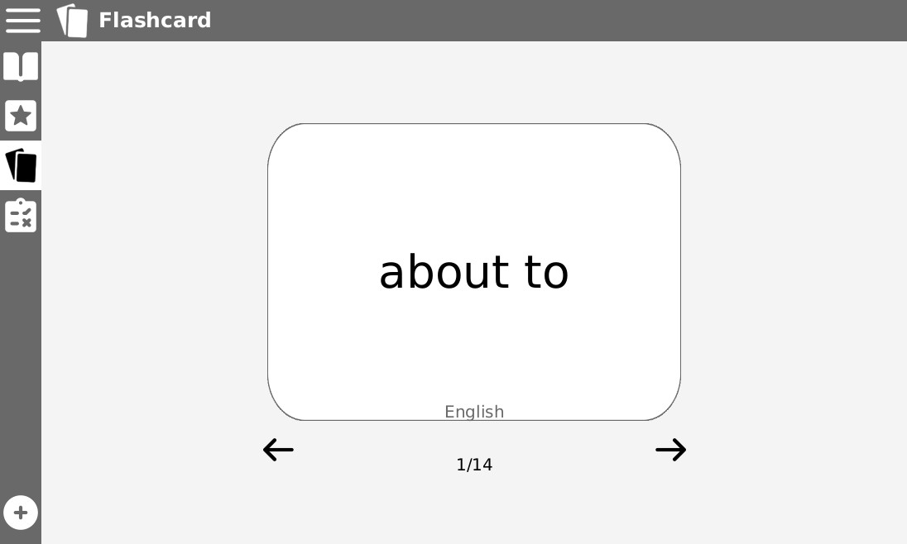

# Welsh Vocabulary Tutor

**Welsh Vocabulary Tutor** is a program that helps people store and learn Welsh vocabulary.
> This is the group repository for Group 20 doing the CS22120 Group Project 2020.

## Features:
### Dictionary

A page where you can view all the currently loaded words, from here you can add/remove to/from your practice list.
### Practice List

This page displays all your practice words, once you're comfortable with a word you can remove it from your practice list through this page.
### Flashcards

This is a quick and easy way to go over your practice words, just like using flashcards in real life but without having to write them all out.
### Study

Once you feel confident enough with some words you can test yourself from this page with a set of three test types.
### Adding new words

Came across a word you would like to add to your vocabulary? No problem! From this page you can add new words to your existing word list, we'll even add it straight to your practice list so you can start trying to memorise it.

## Credits
- Kain Bryan-Jones [kab74]
- Brad Corbett [brc9]
- Henry Dugmore [hjd3]
- Marcin Jakob [maj83]
- Tom Perry [top19]
- Oscar Pocock [osp1]
- Waylen Watts [ncw]
- Luke Wybar [law39]